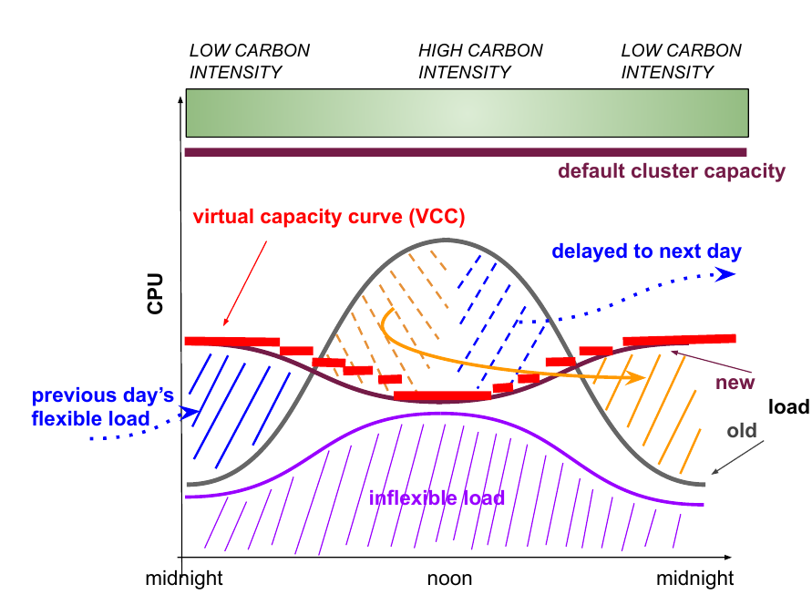
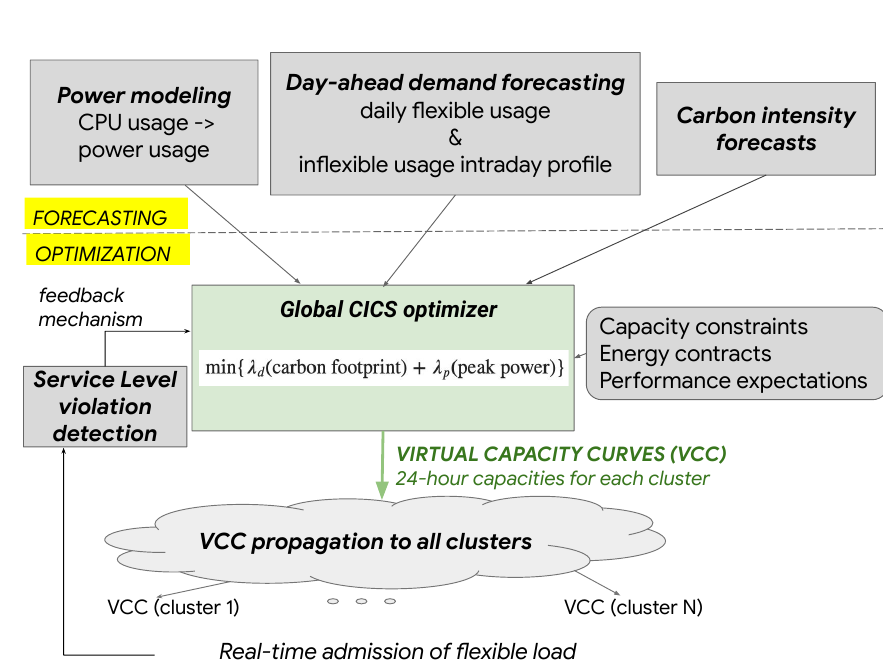
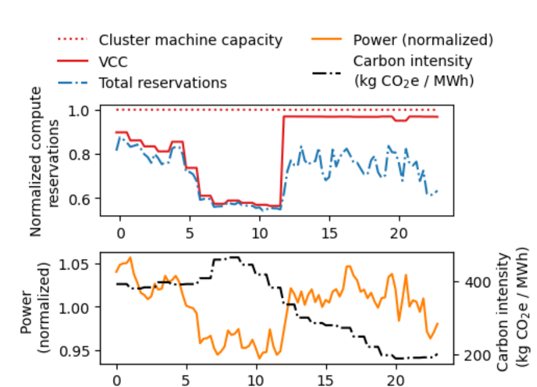
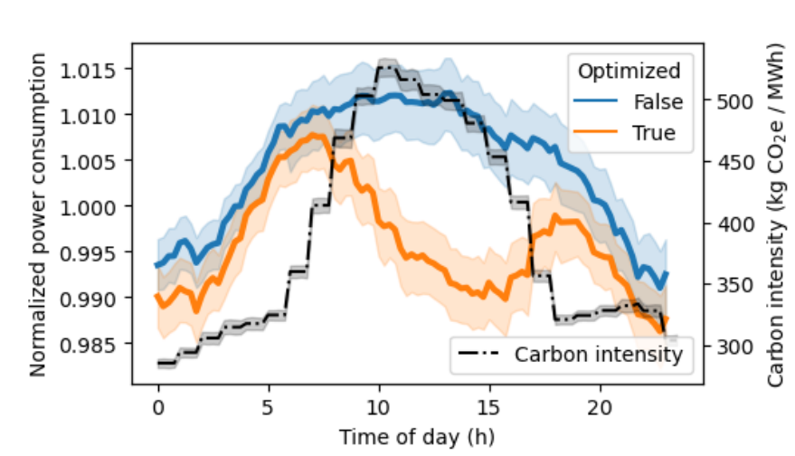

# Video presentation: slides and speaker notes

Target length is about 13 minutes, which leaves room on both sides of the 10-15 minute window. The speaker notes are written to be read aloud at roughly 130 words per minute. Times are a guide. If you run long, cut the parts of slides 7 and 8 marked as optional.

Figures cropped from the paper are in `presentation/figures/`. Put a small caption under each one, for example "Source: Radovanović et al. 2023, Fig. 3".

| # | Slide | Time |
|---|---|---|
| 1 | Title | 0:35 |
| 2 | Why this paper | 0:40 |
| 3 | The problem | 1:00 |
| 4 | Flexible and inflexible work | 0:45 |
| 5 | System architecture | 1:10 |
| 6 | The Virtual Capacity Curve | 0:55 |
| 7 | The optimizer | 0:55 |
| 8 | Results | 1:10 |
| 9 | What I agree with | 0:50 |
| 10 | Critique 1: power is not carbon | 1:15 |
| 11 | Critique 2: where did the work go? | 1:00 |
| 12 | Critique 3: a low ceiling | 0:45 |
| 13 | Critique 4: who decides | 1:05 |
| 14 | Verdict and what would be better | 0:55 |
| 15 | References | 0:10 |
| | **Total** | **about 13:10** |

---

## Slide 1. Title (0:35)

**On screen**

- Moving power is not the same as cutting carbon
- A critical reading of "Carbon-Aware Computing for Datacenters" (Radovanović et al., IEEE Transactions on Power Systems, 2023)
- [Your name] · ID2221 Data-Intensive Computing · KTH · HT26

**Speaker notes**

Hi, I'm [name], and this is my reading assignment for ID2221. The paper I chose is "Carbon-Aware Computing for Datacenters" by Ana Radovanović and colleagues at Google, published in IEEE Transactions on Power Systems in 2023. It describes a system Google runs in production that delays some computing to the hours when the grid is cleaner. I'll cover the problem and the approach, then spend the second half on my own assessment.

---

## Slide 2. Why this paper (0:40)

**On screen**

- Sits on top of Borg, the cluster manager from the resource management lecture
- A real system running across Google's fleet, not a simulation
- Raises the course's critical question: who measures environmental cost, and how?

**Speaker notes**

I picked this paper for two reasons. First, it connects directly to the course. The system is built on top of Borg, which we read about in the resource management lecture, and the jobs it delays are batch pipelines like MapReduce and Flume. Second, it describes a carbon-reduction mechanism that a hyperscaler has actually deployed, which the authors call the first demonstration of its kind. That makes it a good test case for the critical side of the course: what a company chooses to measure, and what it leaves out.

---

## Slide 3. The problem (1:00)

**On screen**

- The CO2 cost of 1 kWh changes by hour and by location
- Schedulers start jobs whenever machines are free, regardless of the grid
- Datacenters use about 1% of global electricity; workloads grew more than 6x from 2010 to 2018
- Datacenters are built for peak power, so peaks drive new construction

**Visual:** the colour bar along the top of `fig3-vcc-mechanism.png` (low / high / low carbon intensity), or a simple hand-drawn curve of carbon intensity over one day.

**Speaker notes**

The problem starts with a simple fact: a kilowatt-hour of electricity does not have a fixed carbon cost. If the grid is running on solar at noon and on gas in the evening, the same job emits very different amounts of CO2 depending on when it runs. A normal cluster scheduler ignores this. If machines are free, it starts the job.

At Google's scale this matters. The authors cite estimates that datacenters use about one percent of the world's electricity, and that datacenter workloads grew more than sixfold between 2010 and 2018. There is also a cost argument. Datacenters are designed around their peak power draw, so if you can flatten the daily peak, you need fewer new buildings. The paper tries to address both at once: carbon and peak power.

---

## Slide 4. Flexible and inflexible work (0:45)

**On screen**

| Flexible (can be delayed) | Inflexible (never delayed) |
|---|---|
| Data compaction | Search, Maps, YouTube serving |
| Machine learning training | Google Cloud customers' VMs |
| Simulation | Higher-tier Borg jobs |
| Video processing pipelines | |
| Must finish **within 24 hours** | |

**Speaker notes**

The opportunity comes from the fact that a lot of Google's internal work is not urgent. Borg already sorts jobs into priority tiers. The paper groups the lowest tier as "flexible": things like data compaction, machine learning training, simulation and video processing. The only requirement is that each day's flexible work gets done within roughly twenty-four hours.

Everything else counts as inflexible. That includes the user-facing services, and also, and this matters later, every workload run by Google Cloud customers on their virtual machines. Those are never touched by this system.

---

## Slide 5. System architecture (1:10)

**On screen:** `fig4-architecture.png`

- Three forecasting inputs feed one daily optimizer
- Output: a Virtual Capacity Curve (VCC) per cluster, 24 hourly values
- A feedback loop switches shaping off when a cluster misses its quota

**Speaker notes**

This is the architecture, taken from the paper. The top row is forecasting. There are three inputs. First, a power model that turns CPU usage into watts. It is a piecewise-linear model per power domain, and the authors report under five percent error for more than ninety-five percent of domains. Second, a day-ahead forecast of each cluster's demand: the hour-by-hour profile of the inflexible work, and the total amount of flexible work for the day. Third, an hourly forecast of the grid's carbon intensity, which Google gets from an outside provider called Tomorrow, the company behind electricityMap.

These feed one global optimizer that runs daily and outputs a Virtual Capacity Curve for every cluster. On the left there is a feedback loop: if a cluster repeatedly fails to finish its flexible work, shaping is switched off there for a week so the forecasts can catch up.

---

## Slide 6. The Virtual Capacity Curve (0:55)

**On screen:** `fig3-vcc-mechanism.png`

- VCC = an hourly cap on CPU available to flexible jobs
- Borg's admission controller treats the VCC as the cluster's capacity
- When the cap is low, flexible jobs wait in the queue
- Borg's scheduling policy itself is unchanged ("scheduler-agnostic")

**Speaker notes**

This figure shows the core mechanism. The purple area at the bottom is inflexible load, which is left alone. The grey curve is what total load would look like without the system. The red dashed line is the Virtual Capacity Curve, an artificial capacity limit for each hour. In the middle of the day, when carbon intensity is high, the curve dips. Flexible work that would have run then, shown in orange and blue, gets pushed to the evening, or even into the next morning.

The clever part is how it plugs into Borg. It does not change the scheduling algorithm at all. It only changes what Borg believes the cluster's capacity is. When the cap is low, flexible jobs fail the admission check and wait in the queue.

---

## Slide 7. The optimizer (0:55)

**On screen**

- Minimise: λe × expected carbon footprint + λp × daily peak power
  - λe in $ per kg CO2e, λp in $ per MW per day
- Constraint: total flexible CPU over the day is unchanged (work is moved, not dropped)
- Risk-aware: capacity set at the 97th percentile of forecast demand
- SLO: flexible work misses its daily quota at most about 1 day per month

**Speaker notes**

The optimizer minimises a weighted sum of two things: the expected carbon footprint, and the daily peak power of each cluster. Both are given a price in dollars, so carbon and infrastructure cost are traded directly against each other. Keep that in mind, because it comes up in my critique.

The main constraint is conservation. The total amount of flexible computing over the day has to stay the same. Work is moved around, never dropped.

*(Optional, cut if running long:)* Because forecasts can be wrong, the daily capacity is set at the 97th percentile of predicted demand. The target is that flexible work misses its daily quota no more than about one day per month.

---

## Slide 8. Results (1:10)

**On screen:** `fig9-cluster-x.png` on the left, `fig12-campus-experiment.png` on the right

- Single clusters: flexible load cut by about 50% at peak carbon hours
  - Cluster X: about 8% less power for 6 hours
  - Cluster Y: about 8% for 3 hours (less predictable load)
  - Cluster Z: no meaningful change (too little flexible load)
- Randomised experiment, one campus, from Feb 2021: **1-2% less power during the highest-carbon hours**

**Speaker notes**

The evaluation has two parts. On the left is one cluster on one day. The red line is the capacity curve, which drops sharply in the morning when carbon intensity, the black dashed line, is highest. Power drops by about eight percent for around six hours. *(Optional:)* In a second cluster with less predictable demand, the drop is similar but lasts only three hours. In a third cluster with very little flexible work, nothing meaningful happens at all.

On the right is the stronger evidence. On one campus, each cluster was randomly assigned each day to be shaped or not, with a fifty percent chance. Orange is shaped, blue is not. Averaged over all clusters and days, shaped clusters used one to two percent less power during the highest-carbon hours. That one-to-two percent is the headline result in the paper's conclusion.

---

## Slide 9. What I agree with (0:50)

**On screen**

- Good systems design: carbon becomes a capacity signal; the scheduler stays simple
- Plans on aggregate daily demand (predictable), not job arrivals (unpredictable)
- Reliability first: gradual rollout, automatic switch-off on SLO violations
- A randomised experiment in production, with a modest result reported honestly

**Speaker notes**

Before the critique, here is what I think the paper gets right.

The design fits Borg well. Borg makes hundreds of thousands of placement decisions per second, so you cannot put a heavy optimization in that path. Making the carbon logic a once-a-day capacity signal keeps the real-time scheduler fast, and the planning pipelines can fail without breaking scheduling. Planning on total daily demand is also sensible, because the total is predictable and individual jobs are not.

I also respect the evaluation method. A randomised controlled experiment on a live fleet is much stronger than the trace-driven simulations most papers in this area use. And the authors put the modest one-to-two percent in their conclusion, not the eight percent from their best cluster.

---

## Slide 10. Critique 1: power is not carbon (1:15)

**On screen**

- The title promises carbon. No result is reported in kg of CO2.
- The authors: computing carbon impact from their data "does not necessarily yield the correct result"
- They optimise against **average** carbon intensity
  - Average = how clean the grid mix is at that hour
  - Marginal = which plant actually responds when load moves
- The authors: the right signal "requires further research"

**Speaker notes**

My biggest disagreement is with the conclusion. The paper is framed around carbon, but there is no result in kilograms of CO2 anywhere in it. Every number is about power. The authors say this directly: calculating the carbon impact from their power and intensity data "does not necessarily yield the correct result", and they leave it for future research.

The reason this matters is the signal they optimise against. They use average carbon intensity, which tells you how clean the overall mix is at a given hour. But when Google removes load from the grid at noon, what matters is which power plant actually ramps down. That is the marginal plant. If the plant that responds is gas at noon and gas in the evening, moving the load changes very little. The authors themselves say the right signal needs more research. So what the paper shows is that Google can move power in time. Whether that reduces emissions, and by how much, is not shown.

---

## Slide 11. Critique 2: where did the work go? (1:00)

**On screen:** `fig12-campus-experiment.png`, with the evening hours (about 17:00 to 23:00) circled

- If work were only delayed, orange should rise above blue in the evening. It never does.
- The authors: under aggressive shaping some jobs "choose" to move to other clusters
- That move "may increase or decrease carbon emissions"
- If the work went to control clusters, the 1-2% is overstated

**Speaker notes**

My second point comes from the paper's own experiment figure. If work were only being shifted in time, the shaped clusters in orange should use less power at midday and more power in the evening, when the delayed work catches up. But look at the evening hours. Orange stays below blue almost the whole day. The work does not seem to come back.

The authors partly explain this. They say that under more aggressive shaping, some flexible jobs "choose" to move to other clusters, and that this spontaneous shift "may increase or decrease carbon emissions". That creates a problem for the experiment. If some of that work landed in the unshaped control clusters, the gap between orange and blue is bigger than the real effect. And if it landed somewhere with a dirtier grid, the carbon benefit could be smaller still.

---

## Slide 12. Critique 3: a low ceiling (0:45)

**On screen**

- Conservation constraint: total energy is rearranged, never reduced
- Idle machines stay on while work waits
- Cloud customers' workloads excluded
- Sukprasert et al., EuroSys 2024 (123 regions): practical gains from shifting are limited and shrink as grids get greener

**Speaker notes**

Third, the ceiling on this approach is low by design. The conservation constraint means the system never reduces total energy, it only moves it. The paper also notes that Google keeps all working machines switched on, so while flexible work waits, the idle machines are still drawing power. And Cloud customers' workloads are excluded completely.

An independent paper by Sukprasert and colleagues at EuroSys 2024 looked at carbon data from 123 regions and concluded that the practical gains from shifting work in time and space are limited, and that they get smaller as grids decarbonise.

---

## Slide 13. Critique 4: who decides (1:05)

**On screen**

- Google decides what is "flexible", sets the price of carbon (λe), picks the metric, runs the test on its own fleet
- Only normalised curves are published; nothing can be checked from outside
- A carbon-only objective would need more machines, so carbon is traded against cost
- Accounting covers electricity only, not hardware manufacturing or water
- *Data Feminism*: examine power · *Atlas of AI*: the cloud's material footprint

**Speaker notes**

My last point uses the course's critical lens. The first principle in D'Ignazio and Klein's Data Feminism is to examine power: who gets to define things, and who benefits. In this paper, Google decides which work counts as flexible, sets the internal price of carbon against the price of peak power, chooses the metric, runs the experiment on its own fleet, and publishes curves that are normalised, with no absolute numbers. No one outside Google can check any of it.

The objective function is also revealing. The authors note that optimising only for carbon would require more machines, so carbon is traded against infrastructure cost. That's a reasonable business choice, but it makes this an efficiency system with a carbon benefit attached, not a climate measure. And as Crawford argues in Atlas of AI, the cloud's material footprint goes well beyond electricity, yet this paper leaves out hardware manufacturing and water entirely.

---

## Slide 14. Verdict and what would be better (0:55)

**On screen**

- **Agree:** a solid systems design and a credible first step
- **Disagree:** "this reduces Google's carbon footprint" is asserted, not shown
- What a stronger paper would do:
  - Report estimated kg CO2 avoided, under average and marginal signals, with uncertainty
  - Track where displaced jobs went
  - Release anonymised traces for independent checks
  - Let Cloud customers opt in to flexible scheduling

**Speaker notes**

So, my overall position. I agree with the engineering. It is a well-designed system and a reasonable first step. I disagree with the paper's conclusion that it helps Google meet its environmental goals, because the evidence shows power being moved, not carbon being cut.

A stronger version would report estimated emissions avoided, in kilograms, under both average and marginal signals and with uncertainty bounds. It would track where the displaced jobs actually went. It would release anonymised traces so others could check the result. And there is a fairer extension built into the design: let Cloud customers opt in, so that the people paying for compute can choose to trade a bit of latency for lower emissions. Thanks for watching.

---

## Slide 15. References (0:10)

**On screen**

1. A. Radovanović et al., "Carbon-Aware Computing for Datacenters," IEEE Trans. Power Systems 38(2):1270-1280, 2023.
2. T. Sukprasert et al., "On the Limitations of Carbon-Aware Temporal and Spatial Workload Shifting in the Cloud," EuroSys 2024.
3. A. Verma et al., "Large-scale cluster management at Google with Borg," EuroSys 2015.
4. C. D'Ignazio and L. F. Klein, Data Feminism, MIT Press, 2020.
5. K. Crawford, Atlas of AI, Yale University Press, 2021.

**Speaker notes**

(Hold this slide for a few seconds without speaking, or say "The references are on screen.")

---

## Recording checklist

- Record slide by slide (in OBS, Zoom, or PowerPoint/Keynote's "record slideshow") so a mistake only costs one slide.
- Do a timed read-through first. If the total is over 14 minutes, cut the optional parts of slides 7 and 8.
- On slides 8 and 11, point at the figure with your cursor or a highlight while you talk about the evening hours and the drop.
- Export as MP4 and watch it once all the way through before submitting.
